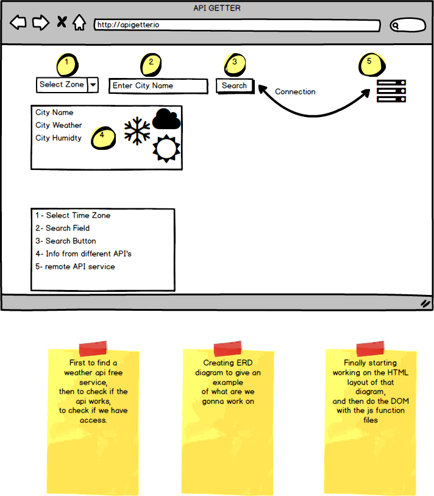

#Welcome to WeatherApuGet

[Link To The Website](https://facn.github.io/WeatherAPIGet)

This project is so simple and easy,
using this code you can see how to deal 
with 3 different Api's which will give the 
best way to learn and get how to deal with different Api's.

This ERD diagram can give you a quick look at how it's working.

